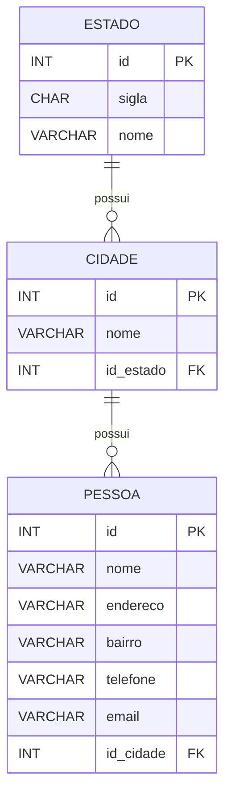

# treinamento horus

Este projeto implementa um CRUD de pessoas utilizando PHP procedural,
com separação simples entre camada de dados, templates HTML e scripts
de controle.

O objetivo foi praticar conceitos apresentados no livro `PHP Programação orientada a objeto: 4ª Edição Pablo Dall’Oglio` como um desafio do treinamento da [horussistem](https://www.horussistemas.com/).

## detalhes
* [Banco de Dados](/detalhes/db.md)


## tecnologias
* php 
* html
* css
* javascript
* Mysql 


## Estrutura do projeto

```
📦treinamento_horus_php
┣ 📂classes
┃ ┣ 📜Cidade.php
┃ ┣ 📜Pessoa.php
┃ ┣ 📜PessoaForm.php
┃ ┗ 📜PessoaList.php
┣ 📂config
┃ ┣ 📜apache2.conf
┃ ┗ 📜livro.ini
┣ 📂css
┃ ┣ 📜form.css
┃ ┗ 📜list.css
┣ 📂db
┃ ┗ 📜pessoa_db.php
┣ 📂html
┃ ┣ 📜form.html
┃ ┣ 📜item.html
┃ ┗ 📜list.html
┣ 📂javascript
┃ ┗ 📜form.js
┣ 📂temp
┃ ┗ 📜lista_combo_cidades.php
┣ 📜README.md
┣ 📜index.php
┗ 📜treinamento.sql

```

## diagrama do banco de dados MYSQL

## Diagrama ER




## Como executar

1. Clone o repositório
```bash
git clone https://github.com/seu-usuario/treinamento_horus
```
2. Importe o banco de dados
```bash
mysql -u root -p < treinamento.sql
```
4. Inicie um servidor PHP
```bash
php -S localhost:8000
```

5. Acesse
```bash
http://localhost:8000/
```
## Progresso
- [X] Level 1
- [X] Level 2
- [X] Level 3
- [X] Level 4
- [X] Level 5
- [X] Level 6
- [X] Level 7