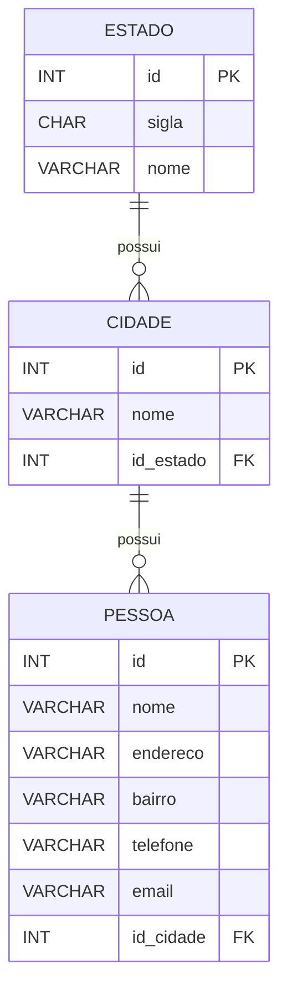

# Banco de Dados

O sistema utiliza **MySQL** com suporte a **UTF-8 completo (`utf8mb4`)** e engine **InnoDB**, permitindo:

* suporte completo a Unicode
* integridade referencial com **Foreign Keys**
* transações
* melhor consistência de dados

O banco de dados é composto por **três entidades principais**:

* `estado`
* `cidade`
* `pessoa`

Essas tabelas modelam uma **hierarquia geográfica** onde:

```
Estado → Cidade → Pessoa
```

Ou seja:

* um **estado possui várias cidades**
* uma **cidade possui várias pessoas**

---

# Estrutura das Tabelas

## Tabela `estado`

Armazena os estados brasileiros.

| Campo | Tipo        | Descrição                        |
| ----- | ----------- | -------------------------------- |
| id    | INT (PK)    | Identificador único do estado    |
| sigla | CHAR(2)     | Sigla do estado (ex: AL, SP, RJ) |
| nome  | VARCHAR(25) | Nome completo do estado          |

### Restrições

* `PRIMARY KEY (id)`
* `UNIQUE(sigla)`
* `UNIQUE(nome)`

Isso garante que **não existam estados duplicados**.

---

## Tabela `cidade`

Armazena cidades associadas a um estado.

| Campo     | Tipo        | Descrição                        |
| --------- | ----------- | -------------------------------- |
| id        | INT (PK)    | Identificador da cidade          |
| nome      | VARCHAR(50) | Nome da cidade                   |
| id_estado | INT (FK)    | Estado ao qual a cidade pertence |

### Restrições

* `PRIMARY KEY (id)`
* `FOREIGN KEY (id_estado)` → `estado(id)`
* `UNIQUE(nome)`

A chave estrangeira garante que **uma cidade só pode existir se estiver vinculada a um estado válido**.

---

## Tabela `pessoa`

Armazena os registros de pessoas cadastradas no sistema.

| Campo     | Tipo         | Descrição                   |
| --------- | ------------ | --------------------------- |
| id        | INT (PK)     | Identificador da pessoa     |
| nome      | VARCHAR(150) | Nome completo               |
| endereco  | VARCHAR(255) | Endereço da pessoa          |
| bairro    | VARCHAR(100) | Bairro                      |
| telefone  | VARCHAR(20)  | Telefone                    |
| email     | VARCHAR(100) | Email                       |
| id_cidade | INT (FK)     | Cidade onde a pessoa reside |

### Restrições

* `PRIMARY KEY (id)`
* `UNIQUE(email)`
* `FOREIGN KEY (id_cidade)` → `cidade(id)`

A restrição `UNIQUE(email)` garante que **não existam duas pessoas com o mesmo email**.

---

# Relacionamentos

| Origem | Destino | Tipo |
| ------ | ------- | ---- |
| estado | cidade  | 1:N  |
| cidade | pessoa  | 1:N  |

Significado:

* Um **estado pode possuir várias cidades**
* Uma **cidade pode possuir várias pessoas**
* Uma **pessoa pertence a apenas uma cidade**

---

# Diagrama Entidade-Relacionamento

## Diagrama ER



---

# Integridade Referencial

O banco utiliza **foreign keys** para garantir consistência:

* Uma `cidade` **não pode existir sem um `estado`**
* Uma `pessoa` **não pode existir sem uma `cidade` válida**

Isso evita dados inconsistentes como:

```
Pessoa → cidade inexistente
Cidade → estado inexistente
```

---

# Charset e Collation

Todas as tabelas utilizam:

```
CHARSET = utf8mb4
COLLATE = utf8mb4_unicode_ci
```

Isso garante:

* suporte completo a Unicode
* armazenamento correto de acentos
* compatibilidade com emojis e caracteres especiais

---

# Seed inicial

O banco inclui um exemplo inicial de dados:

```sql
INSERT INTO estado (id, sigla, nome)
SELECT 1, 'AC', 'Acre'
WHERE NOT EXISTS (
    SELECT 1 FROM estado WHERE nome = 'Acre'
);

INSERT INTO cidade (id, nome, id_estado)
SELECT 1, 'Rio Branco', 1
WHERE NOT EXISTS (
    SELECT 1 FROM cidade WHERE nome = 'Rio Branco'
);
```

Esse padrão evita **duplicação de dados ao executar o script múltiplas vezes**.

---

# Estrutura lógica do banco

```
estado
   │
   └── cidade
           │
           └── pessoa
```

